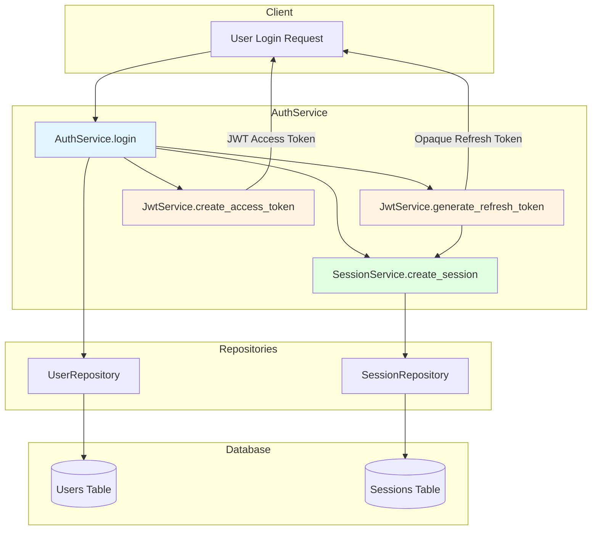
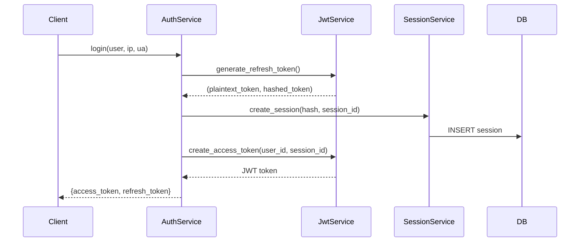

# JWT Service with Opaque Refresh Tokens - Implementation Plan

## Overview

Implement a clean JWT service with opaque (non-JWT) refresh tokens following the provided production specification.

## Architecture Diagram



## Token Flow



## Implementation Steps

### 1. Fix `jwt_service.py`

**Status**: ❌ File is corrupted (lines 119-243 contain duplicate/broken code)

**Action**: Replace entire file with clean implementation:

- Remove `REFRESH_TOKEN_TYPE` constant
- Remove `create_refresh_token()` method (JWT-based)
- Remove `verify_refresh_token()` method (JWT-based)
- Add `generate_refresh_token()` method (opaque, returns tuple)
- Add `hash_refresh_token()` method
- Update `_decode_raw()` to include `options={"verify_aud": False}`
- Remove `_refresh_exp_minutes` from `__init__`

**Key Changes**:

```python
# BEFORE (JWT refresh tokens)
REFRESH_TOKEN_TYPE = "refresh"
def create_refresh_token(...) -> str: ...
def verify_refresh_token(...) -> RefreshTokenPayload: ...

# AFTER (Opaque refresh tokens)
def generate_refresh_token(self) -> tuple[str, str]: ...
def hash_refresh_token(self, token: str) -> str: ...
```

---

### 2. Create `UserRepository` in `users_repositories.py`

**Status**: ❌ File is empty

**Action**: Implement UserRepository with basic CRUD operations:

- `get_by_id(user_id: int) -> User | None`
- `get_by_username(username: str) -> User | None`
- `get_by_email(email: str) -> User | None`
- `add(user: User) -> None`
- `save() -> None`

**Dependencies**:

- `app.models.users.User`
- `sqlalchemy.ext.asyncio.AsyncSession`

---

### 3. Create `auth_errors.py`

**Status**: ❌ File is empty

**Action**: Implement auth-specific exceptions:

- `AuthError` (base class)
- `InvalidCredentialsError`
- `UserNotFoundError`
- `UserInactiveError`
- `PasswordMismatchError`

**Pattern**: Follow existing error pattern from `jwt_errors.py` and `session_errors.py`

---

### 4. Create `auth_schemas.py`

**Status**: ❌ File is empty

**Action**: Implement auth schemas:

- `LoginInput` (username, password)
- `LoginResponse` (access_token, refresh_token)
- `RefreshTokenInput` (refresh_token)
- `RefreshTokenResponse` (access_token, refresh_token)

**Dependencies**:

- `pydantic.BaseModel`

---

### 5. Implement `AuthService` in `auth_services.py`

**Status**: ❌ File is empty

**Action**: Implement AuthService with:

- `__init__(jwt_service, session_service, user_repo)`
- `async def login(user: User, ip: str | None, ua: str | None) -> LoginResponse`
  - Generate opaque refresh token (plaintext + hash)
  - Create session with hashed token
  - Create JWT access token
  - Return both tokens

**Key Implementation**:

```python
async def login(self, user: User, ip: str | None, ua: str | None):
    refresh_token, refresh_hash = self.jwt.generate_refresh_token()
    session_id = uuid4().hex

    await self.sessions.create_session(
        SessionCreate(
            user_id=user.id,
            session_id=session_id,
            refresh_token_hash=refresh_hash,
            expires_at=...,  # from config
            ip_address=ip,
            user_agent=ua,
        )
    )

    access_token = self.jwt.create_access_token(
        user_id=user.id,
        session_id=session_id,
    )

    return {
        "access_token": access_token,
        "refresh_token": refresh_token,
    }
```

**Dependencies**:

- `app.services.jwt.jwt_service.JwtService`
- `app.services.sessions.session_services.SessionService`
- `app.repositories.users_repositories.UserRepository`
- `app.models.users.User`
- `app.services.sessions.session_schemas.SessionCreate`
- `uuid.uuid4`

---

### 6. Update `repositories/__init__.py`

**Status**: ⚠️ Missing UserRepository export

**Action**: Add UserRepository to exports

```python
from .sessions_repo import SessionRepository
from .users_repositories import UserRepository

__all__ = ["SessionRepository", "UserRepository"]
```

---

### 7. Verify All Imports and Dependencies

**Action**: Ensure all imports are correct:

- `jwt_service.py` imports: `hashlib`, `secrets`, `jwt`, `JwtConfig`, error classes, `AccessTokenPayload`
- `auth_services.py` imports: `uuid`, `JwtService`, `SessionService`, `UserRepository`, `User`, `SessionCreate`
- `auth_errors.py` imports: `AppBaseExceptionError`
- `auth_schemas.py` imports: `pydantic`

---

## File Summary

| File | Status | Action Required |
|------|--------|-----------------|
| `jwt_service.py` | ❌ Corrupted | Replace with clean implementation |
| `users_repositories.py` | ❌ Empty | Create UserRepository |
| `auth_errors.py` | ❌ Empty | Create auth exceptions |
| `auth_schemas.py` | ❌ Empty | Create auth schemas |
| `auth_services.py` | ❌ Empty | Implement AuthService |
| `repositories/__init__.py` | ⚠️ Incomplete | Add UserRepository export |
| `session_services.py` | ✅ Good | No changes needed |

---

## Key Design Principles

1. **JWT for Access Tokens Only**: Stateless, short-lived (10 minutes default)
2. **Opaque Tokens for Refresh**: Stored in database, revocable, long-lived (7 days default)
3. **Clear Boundaries**:
   - `JwtService`: Cryptographic operations only (sign/verify tokens)
   - `SessionService`: Session state management
   - `AuthService`: High-level auth orchestration
4. **No Business Logic in JWT**: `is_admin`, `is_active`, `roles`, `permissions` belong in auth dependencies/policies

---

## Next Steps

Once this plan is approved, switch to **Code mode** to implement all the changes.
